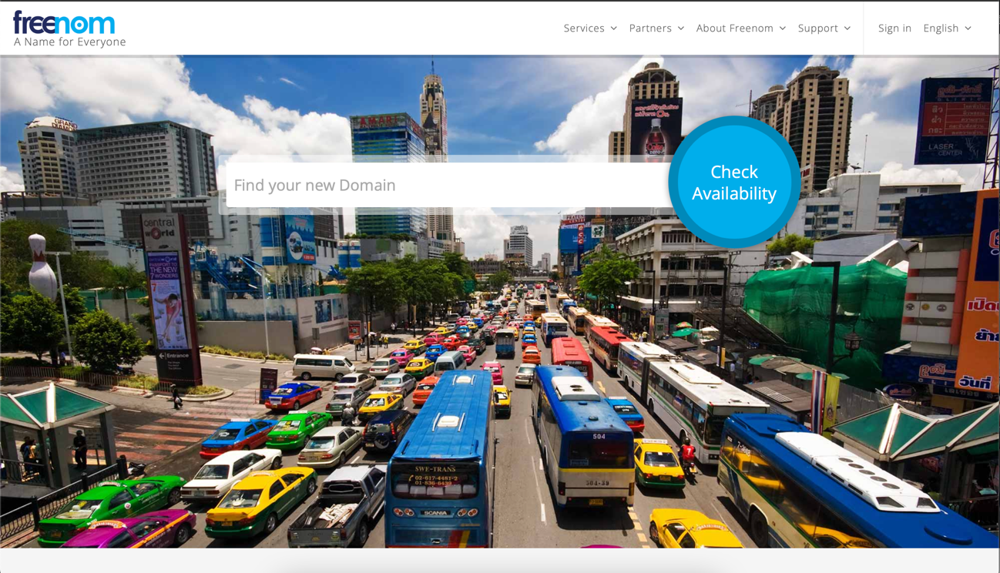
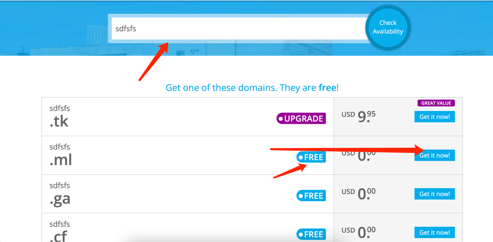
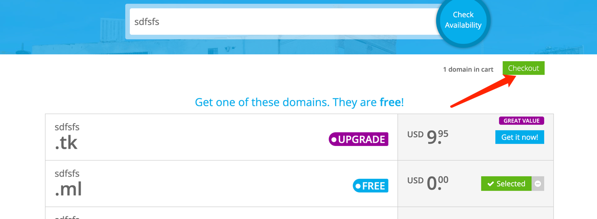
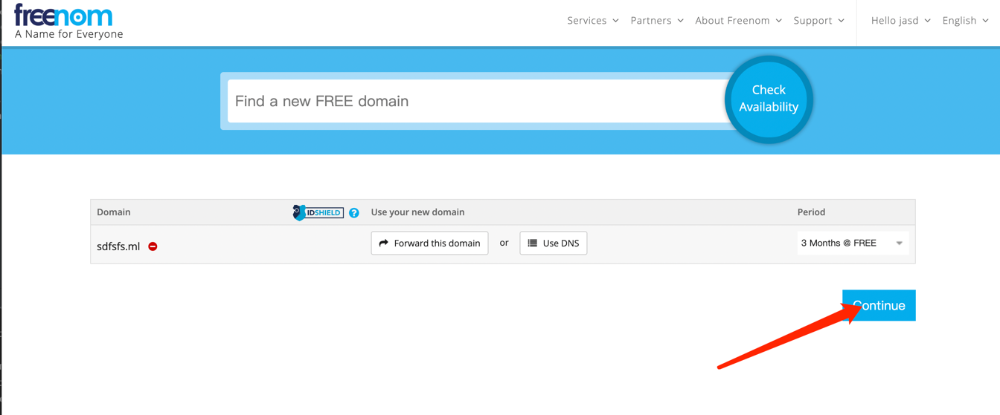
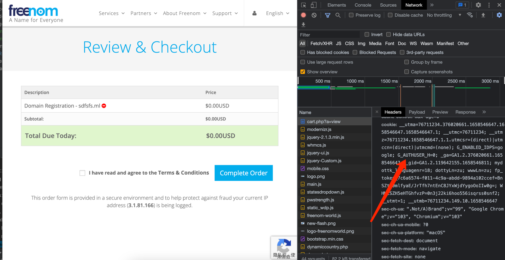
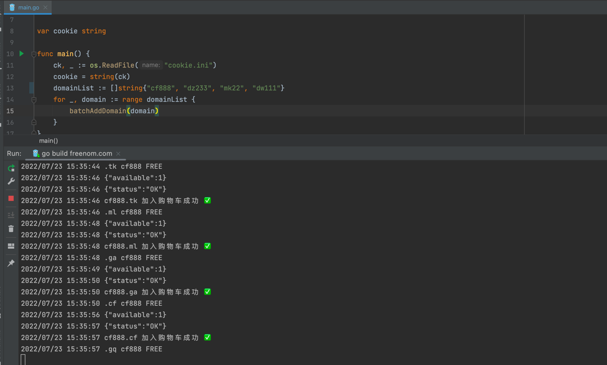
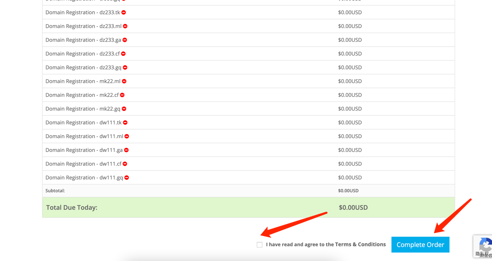

<p align="center"><a href="https://my.freenom.com/domains.php" target="_blank" rel="noopener noreferrer"></a></p>
<p align="center">
    <a href="https://github.com/YunzhiYike/freenom-domain-spider"></a>
    <a href="https://github.com/YunzhiYike/freenom-domain-spider"></a>
    <a href="https://github.com/YunzhiYike/freenom-domain-spider"></a>
</p>

# 介绍

freenom-domain-spider是一个基于Golang原生Http库实现的一个自动采集域名➕下单爬虫工具🔧

# 功能模块🌿·
```markdown
1. DomainCollection // 采集出免费域名
   
2. SelectDomain // 选择指定域名

3. SetDomainValidTime // 设置雇佣域名时常 提示💡【3M 6M 12M】M表达月 最长免费使用12个月
```

# 使用方法🎯

## step1. 登陆 [freenom](https://my.freenom.com/domains.php)



## step2. 随便搜索一个域名 ➡️ 



## step3. 加入域名到购物车





## step4. 打开开发者工具提取cookie ⚠️提取cookie后不要关闭这个页面后面会用到



## step5. 将cookie保存到`cookie.ini`配置文件中📃

## step6. `main.go`中配置你想要到域名

```golang
func main() {
	ck, _ := os.ReadFile("cookie.ini")
	cookie = string(ck)
	// 你想注册到域名
	domainList := []string{"yunzhiyike", "vip", "vipdy", "mmvp", "ks", "dy", "hao123", "jd123", "tb123"}
	for _, domain := range domainList {
		batchAddDomain(domain)
	}
}
```

## step7. 执行程序

```shell
go run main.go
```



## step end🔚 刷新刚刚提取cookie的购物车页面进行下单


